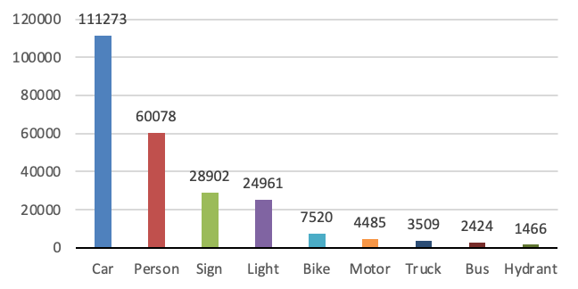
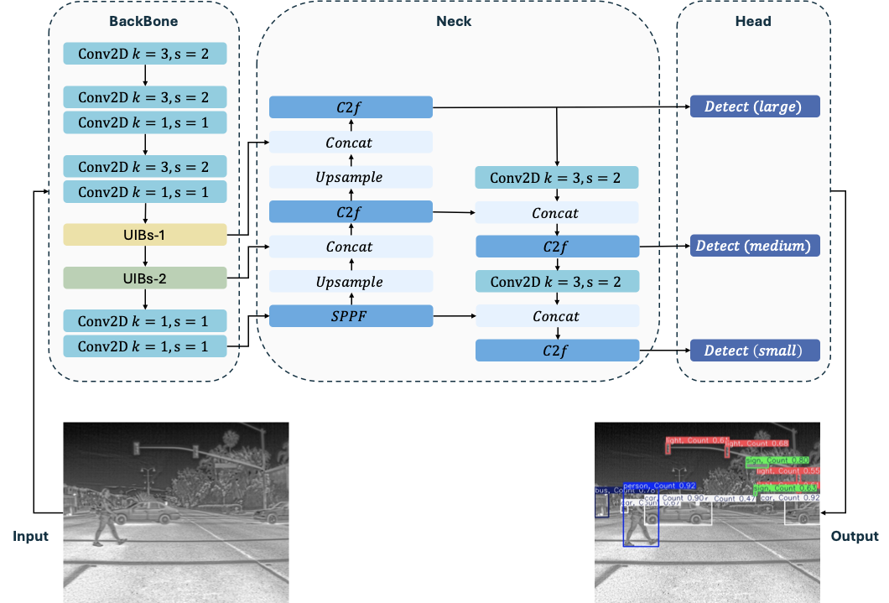
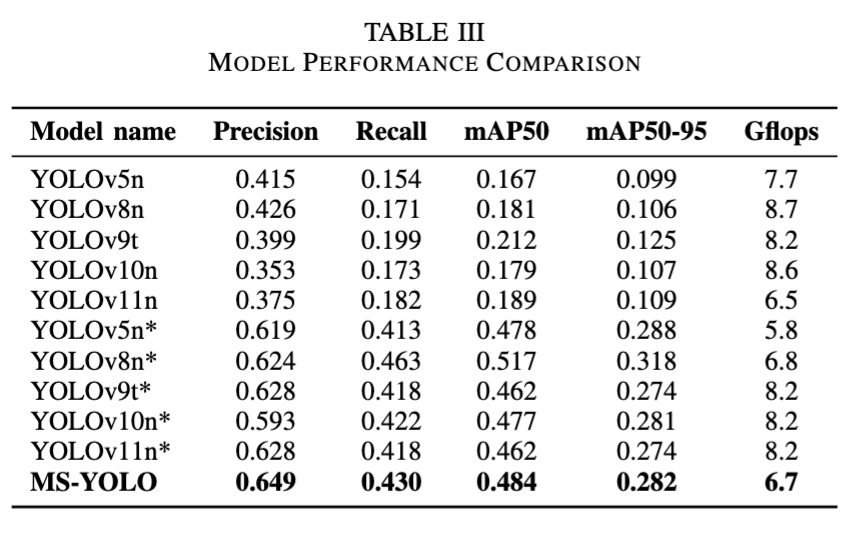

# MS-YOLO: Infrared Object Detection for Edge Deployment via MobileNetV4 and SlideLoss

This repository contains the implementation of MS-YOLO, a lightweight object detection model optimized for infrared imaging and edge deployment. The model integrates MobileNetV4 backbone with a novel SlideLoss function to achieve efficient detection performance on resource-constrained devices.

## Abstract

Infrared imaging has emerged as a robust solution for urban object detection under low-light and adverse weather conditions, offering significant advantages over traditional visible-light cameras. However, challenges such as class imbalance, thermal noise, and computational constraints can significantly hinder model performance in practical settings. To address these issues, we evaluate multiple YOLO variants on the FLIR ADAS V2 dataset, ultimately selecting YOLOv8 as our baseline due to its balanced accuracy and efficiency. Building on this foundation, we present MS-YOLO (**M**obileNetv4 and **S**lideLoss based on YOLO), which replaces YOLOv8's CSPDarknet backbone with the more efficient MobileNetV4, reducing computational overhead by **1.5%** while sustaining high accuracy. In addition, we introduce *SlideLoss*, a novel loss function that dynamically emphasizes under‑represented and occluded samples, boosting precision without sacrificing recall. Experiments on the FLIR ADAS V2 benchmark show that MS-YOLO attains competitive mAP and superior precision while operating at only **6.7 GFLOPs**. These results demonstrate that MS-YOLO effectively addresses the dual challenge of maintaining high detection quality while minimizing computational costs, making it well-suited for real‑time edge deployment in urban environments.

## Dataset

The model is trained and evaluated on the **FLIR Thermal Dataset**, focusing on 9 object classes:



## Model architecture



## Results

MS-YOLO achieves competitive detection accuracy while maintaining efficiency suitable for edge deployment.



## Citation

```bibtex
@article{zhang2025mnv4yolo,
  title={MS-YOLO: Infrared Object Detection for Edge Deployment via MobileNetV4 and SlideLoss},
  author={Zhang, Jiali and White, Tyler and Zhang, Haochen and Hu, Weihua and Wunsch, Donald C. II and Liu, Jingwei},
  booktitle={International Joint Conference on Neural Networks (IJCNN)},
  year={2025},
  address={Rome, Italy},
  month={June 30 - July 5}
}
```

## License

This project is licensed under the MIT License.
